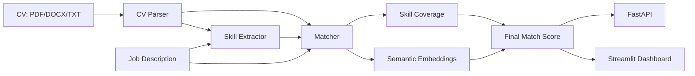

# 🎯 AI Internship Matcher

An AI-powered CV-to-internship/job matcher that combines **semantic embeddings** with **transparent skill-gap analysis**. Upload a CV, paste a job description, and get a match score, matched skills, missing skills, and actionable CV recommendations.


## ✨ Features

- PDF, DOCX, TXT, and Markdown CV parsing
- Semantic similarity with `sentence-transformers/all-MiniLM-L6-v2`
- Automatic fallback to local lexical cosine similarity
- Skill extraction with aliases (Python, ML, NLP, CV, Docker, cloud, etc.)
- Matched skills, missing skills, and additional CV skills
- Explainable scoring: **70% semantic fit + 30% skill coverage**
- CV improvement recommendations
- Streamlit dashboard
- FastAPI endpoint for integrations
- Lightweight unit tests + GitHub Actions CI
- Docker support
- No paid API key required

## 🧠 Architecture



## 🚀 Quick start

Python **3.10-3.12** is recommended.

```bash
git clone https://github.com/aymanboufounas/AI-Internship-Matcher.git
cd AI-Internship-Matcher
python -m venv .venv
```

Windows PowerShell:

```powershell
.\.venv\Scripts\Activate.ps1
pip install -r requirements.txt
streamlit run app.py
```

Linux/macOS:

```bash
source .venv/bin/activate
pip install -r requirements.txt
streamlit run app.py
```

The first semantic analysis may download the MiniLM model.

### Lightweight mode

If you do not want to install Sentence Transformers/PyTorch:

```bash
pip install -r requirements-lite.txt
streamlit run app.py
```

Select **Fast local** in the sidebar.

## 🔌 FastAPI

```bash
uvicorn api:app --reload
```

Open `http://127.0.0.1:8000/docs` for interactive API documentation.

Example request:

```json
{
  "cv_text": "Python and SQL developer with machine learning projects...",
  "job_description": "AI intern required: Python, SQL, Docker and FastAPI...",
  "use_transformer": false
}
```

## 🧪 Tests

```bash
python -m unittest discover -s tests -v
```

## 📊 Scoring

The default score is intentionally explainable:

```text
Final Match = 70% Semantic Similarity + 30% Skill Coverage
```

The score is a decision-support signal, not a hiring decision or guarantee.

## 📁 Project structure

```text
AI-Internship-Matcher/
├── app.py
├── api.py
├── src/
│   ├── cv_parser.py
│   ├── matcher.py
│   ├── recommendations.py
│   └── skill_extractor.py
├── data/
│   ├── skills.csv
│   └── sample_job.txt
├── examples/
│   └── sample_cv.txt
├── tests/
├── .github/workflows/tests.yml
├── Dockerfile
├── requirements.txt
└── requirements-lite.txt
```

## 🐳 Docker

```bash
docker build -t ai-internship-matcher .
docker run -p 8501:8501 ai-internship-matcher
```

## 🔭 Ideas for v2

- Rank multiple internships for one CV
- ATS keyword heatmap
- Multilingual CV/JD matching
- Explainable sentence-level evidence
- Saved analyses and authentication
- Job feed integrations

## 👤 Author

**Ayman Boufounas**  
GitHub: [@aymanboufounas](https://github.com/aymanboufounas)

## 📄 License

MIT
